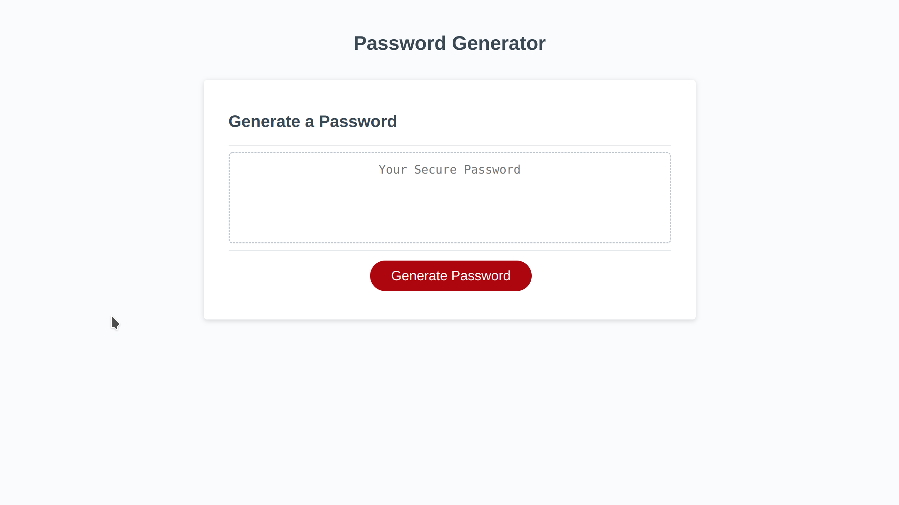
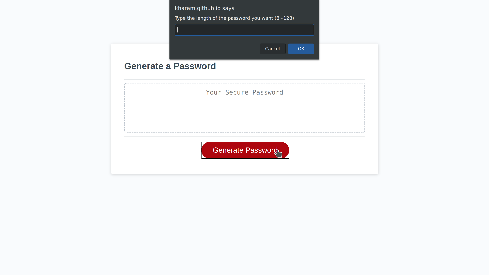
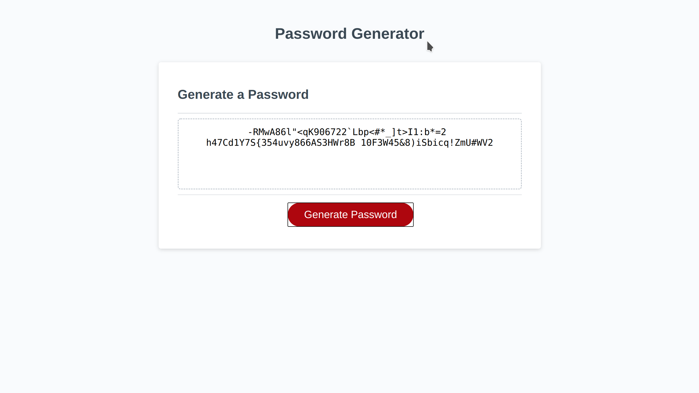

# Password generator with javascript.

This repository generate the password with javascript confirm message. It will generate a strong password based on following criteria

- length (8..128)
- Lowe case
- Upper case
- Number
- Special Character ` !\"#$%&'()*+,-./:;<=>?@[]^_`{|}~`

## Use case

- User opens the webpage.
- click the generate password button
- the user will get prompt about the specification about the password

  - user type the number between 8 to 128
  - confirm lower case
  - confirm upper case
  - confrim number
  - confirm special character

## Screen shot of the application

### The first screen

### Click generate password, and show prompt

### After prompt, show generated password

